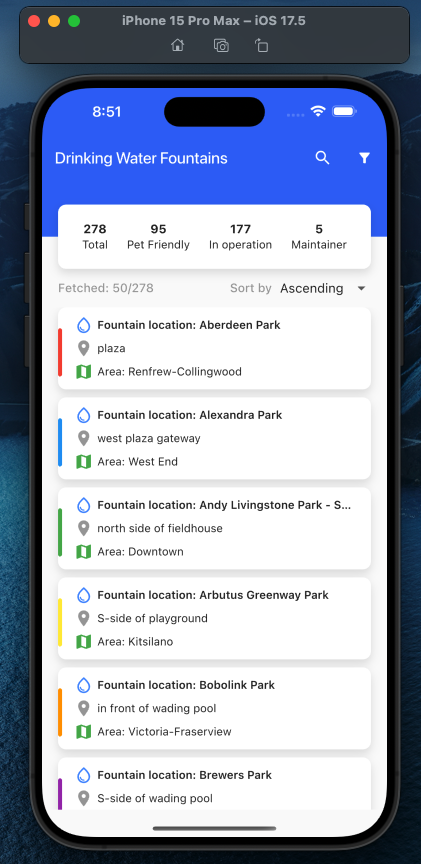
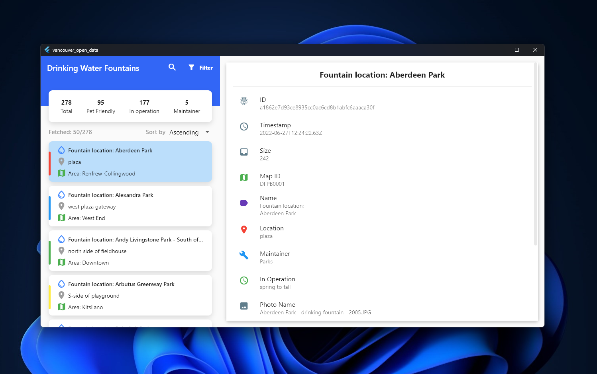

# Vancouver Open Data Fountain App

This Flutter app uses the **Drinking Water Fountain** data from the Vancouver Open Data Portal. It provides users with a clean and responsive interface, allowing them to filter, search, and sort water fountains across Vancouver.

## Features
- **List of Water Fountains**: Displays a list of water fountains with details.
- **Filtering, Searching, and Sorting**: Easily find and sort fountains based on various criteria.
- **Responsive UI**: Compatible with different screen sizes, ensuring a smooth user experience on mobile, tablet, and desktop.
- **Error Handling**: Meaningful error messages for network issues, ensuring a seamless experience.
- **Gesture Interaction**: Tap and scroll gestures make interacting with the app easy and intuitive.
- **Pagination with Lazy Loading**: Fetched data is loaded in batches of 50 records to improve performance. Scrolling to the end automatically loads more data.
- **Google Maps Navigation**: The app can direct users to Google Maps to find the fountain’s location.

## Screenshots
Here are a few screenshots showcasing the app’s functionality and UI design:

### Mobile View

### Windows View

## APK & EXE Installation Instructions
- **APK (Android Installer)**: Since the app is unsigned, your device may prompt a warning to trust the source. Please allow installation from untrusted sources.
- **EXE (Windows Installer)**: Your browser might ask for consent to keep the file. Please allow it.

## Running the Source Code
1. Download the source code.
2. Run `flutter pub get` to install the dependencies.
3. Execute the project using `flutter run`.

### Dependencies
- **State Management**: GetX (`get: ^4.6.6`)
- **Network Calls**: Dio (`dio: ^5.7.0`)

## Additional Notes
- **API Limitations**: The filtering, searching, and sorting functionality are based on the available fetched data as the API has limited support for these features.
- **Mocked Data**: Some statistical data is mocked to simulate additional functionality.

## Installation Links
You can download the project files, including the APK, EXE, and source code, from the link below:
[Download Link](https://github.com/mhutshow/city_of_vacnouver_open_data/tree/main/installers)

## Contact
Feel free to reach out with any questions or feedback. Thank you!

---

**Mahedi Hasan**
